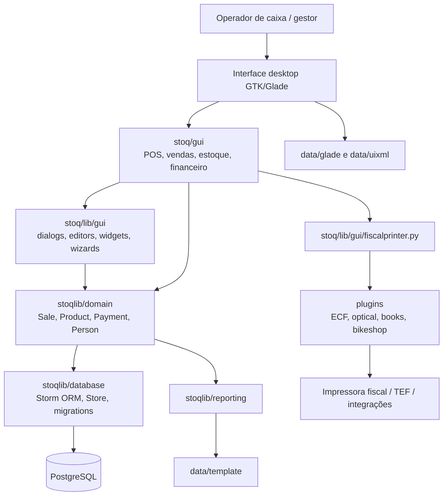
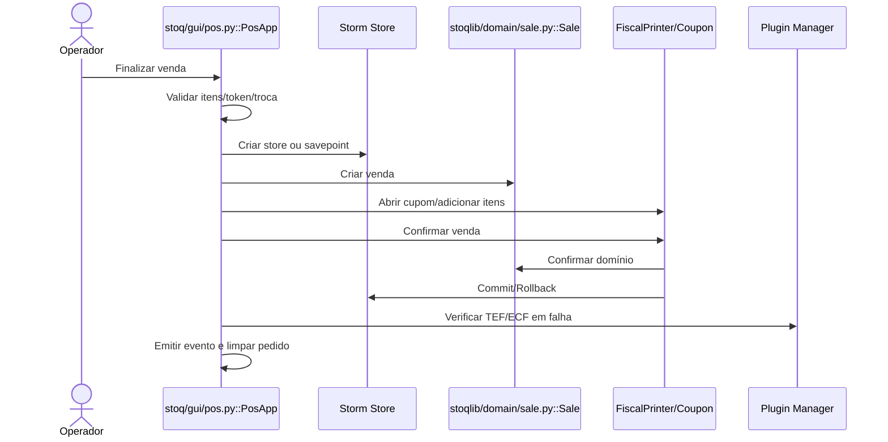
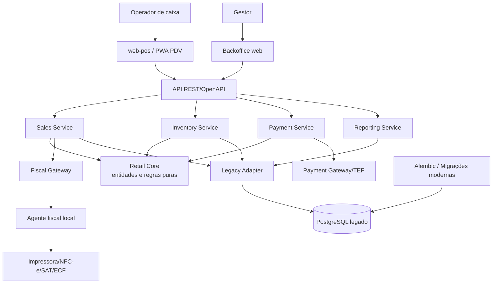
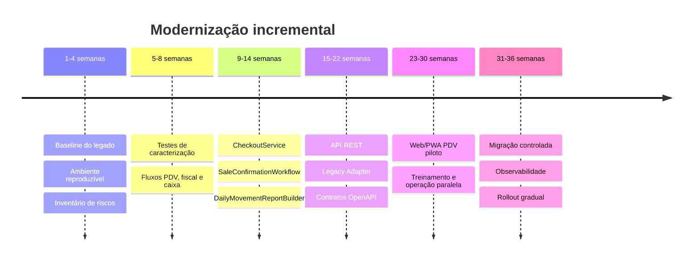

# Anexo: Diagramas Mermaid

Os diagramas abaixo podem ser colados em editores compatíveis com Mermaid, como GitHub, Obsidian, Mermaid Live Editor ou extensões do VS Code.

## 1. Arquitetura atual

## 2. Fluxo atual de checkout

## 3. Arquitetura proposta

## 4. Estratégia Strangler Fig

